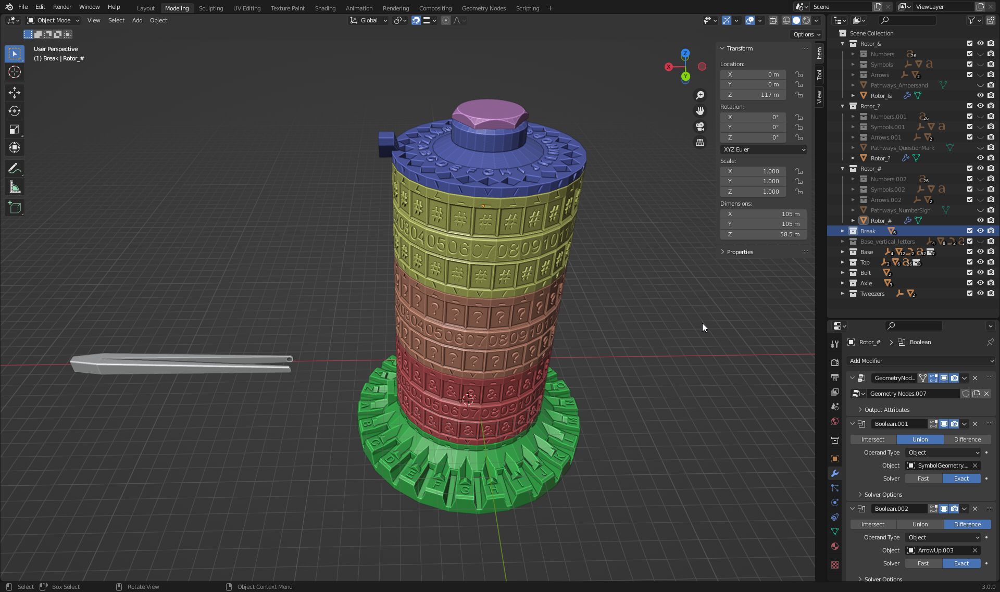

# Tower cipher mesh

I've tried to keep everything in Tower cipher model as parametric as possible.
Creating rotor should be fairly simple:
- create new pathways in Pathways generator tool
- import them into Blender
- align to existing pathways in one of the existing rotors
- change Symbol text on rotor (it's parametric, so it's really just one letter and it's done)
- export to STL
- import to slicer and **carefully check all layers if there are any glitches, holes, etc..**

### Note:
Most tolerances are made by Solidify modifier on "Hole" version of object.