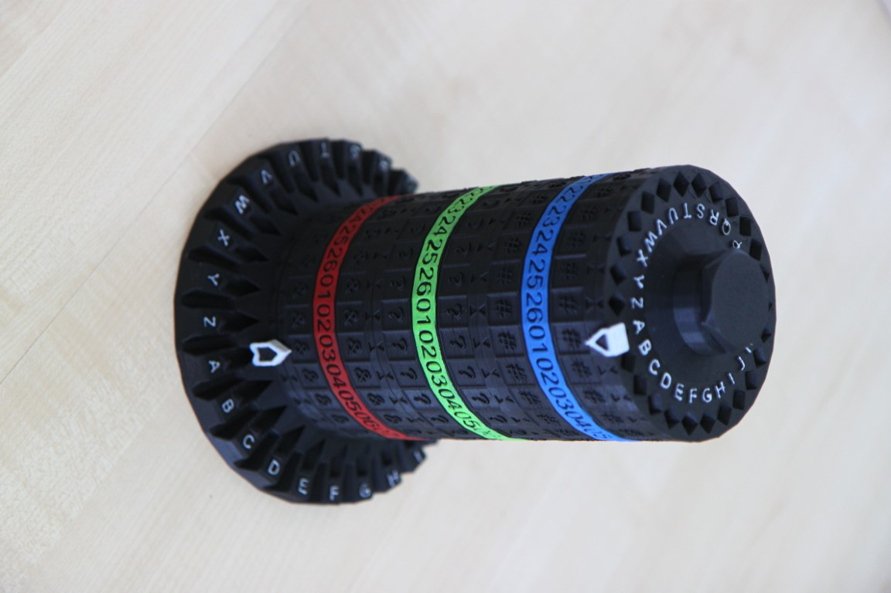
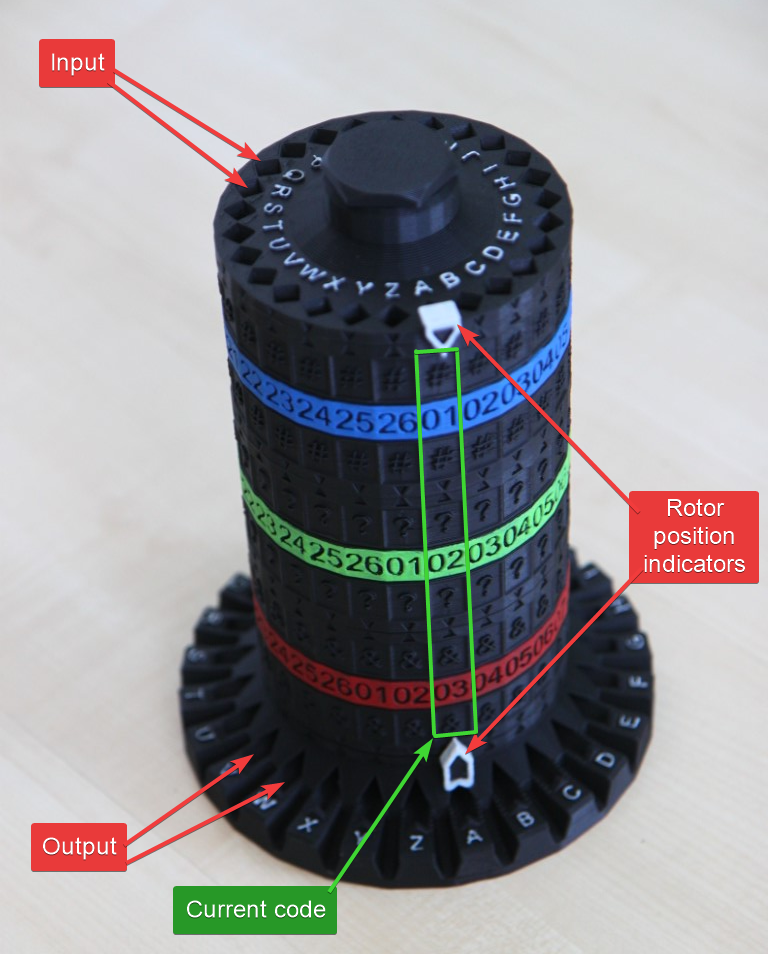
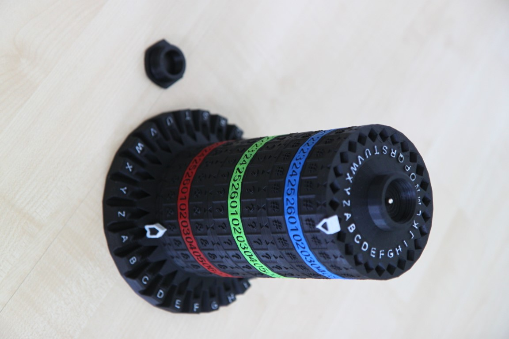
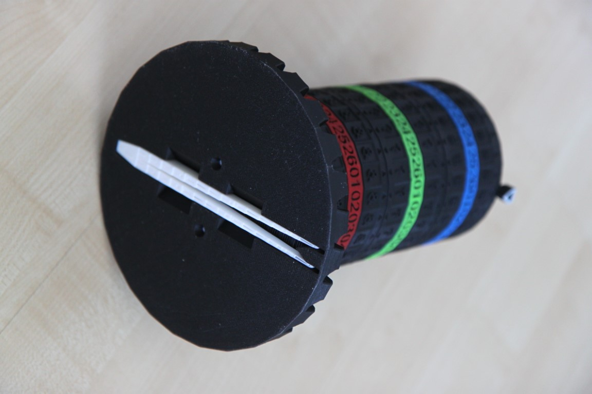

# The Tower cipher
Mechanical 3D printable cipher device for **education and hobby purposes** only.
It's based on the similar principle as most rotor cipers.
The Tower cipher uses **5mm metalic (or glass) ball** as a signal carrier to trace letters through pseudo-random pathways inside rotors.



## Folders
[STL](https://github.com/assemblerbot/tower-cipher/tree/main/STL) contains printable files and assembly instructions.
In the [Model](https://github.com/assemblerbot/tower-cipher/tree/main/Model) folder there is a Blender source file for the whole device.
[Tools/Pathways generator](https://github.com/assemblerbot/tower-cipher/tree/main/Tools/PathwaysGenerator) is the tool I've created for generating internal pathways.

## Operation


### Video
[YouTube - how to use Tower cipher](https://youtu.be/TXNiqYJ8YBw)

### Printable sites
[Tower cipher on Printables](https://www.printables.com/model/290571-tower-cipher)

### Key
Secret phrase or the key consists of 2 mandatory parts and one optional part:
- order of rotors
- rotor settings
- optional - rotation pattern

Consider following example of the key (also on the picture above):
```
#01 ?02+1 &03
```

In this case:
- order of rotors from top to bottom in case of encryption and from bottom to top in case of decryption is `#?&`
- rotor `#` must be set to position `01`
- rotor `?` must be set to position `02`
- rotor `&` must be set to position `03`

There is also an optional rotation pattern: after each letter the position on the rotor `?` should be increased by `+1`.

### Encryption
1. Setup the device. Order of rotors is by the key **from top to bottom**.
2. Throw the ball to the letter hole on the top for next letter of a plaintext.
3. Ball returnes from one of bottom holes and indicates the letter from ciphertext.
4. Turn rotors by rotation pattern.
5. Repeat from step 2.

### Decryption
1. Setup the device. Order of rotors is inverted **from bottom to top**.
2. Throw the ball to the letter hole on the top for each ciphertext.
3. Ball returnes from one of bottom holes and indicates the letter from plaintext.
4. Turn rotors by rotation pattern.
5. Repeat from step 2.

## Additional features
There is a small ball storage on the top.


Tweezers can be stored in a storage are at the bottom of the base part.


## Notes

### Rotation pattern
Rotation pattern is optional.
If it's missing the device works as simple substitution cipher susceptible to frequency analysis.

### Internal rotor structure
Published version of Tower cipher uses 3 layers per each rotor where pin connections occur (see the Pathways generator for details).
Therefore randomness of connections is limited and is not entirely random.

Also straight connections (A to A) and short connections between neighbouring pins are not implemented.

### Key strength
Since the internal structure of the device is known, there are `3*2*1` combinations of rotor placements and `26*26*26` combinations of rotor positions which yields `105456` combinations the key without rotation patterns.
Rotation pattern can significantly increase the encryption strength yet too complex patterns might be hard to use.