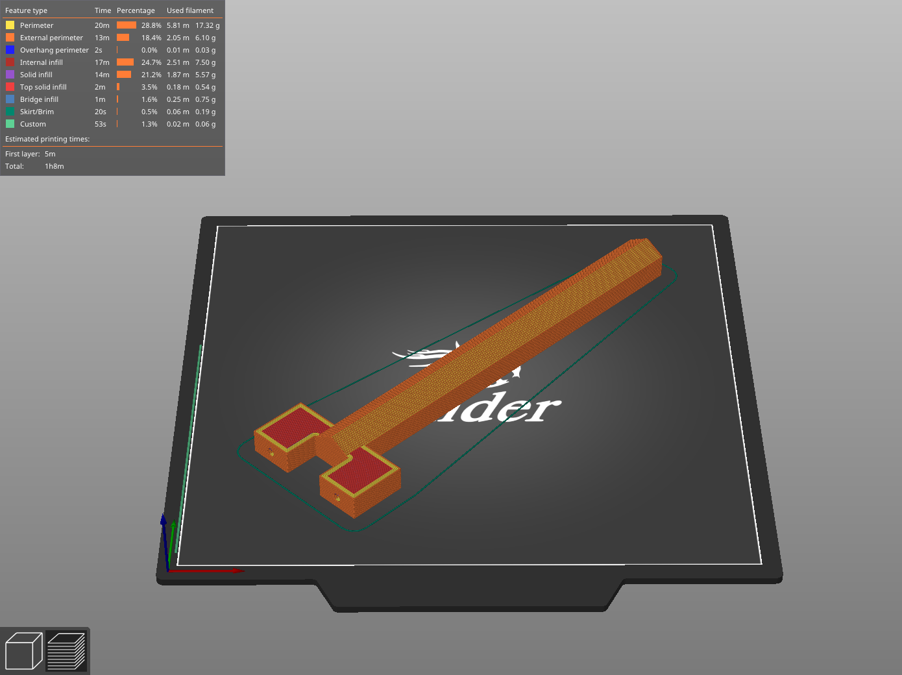
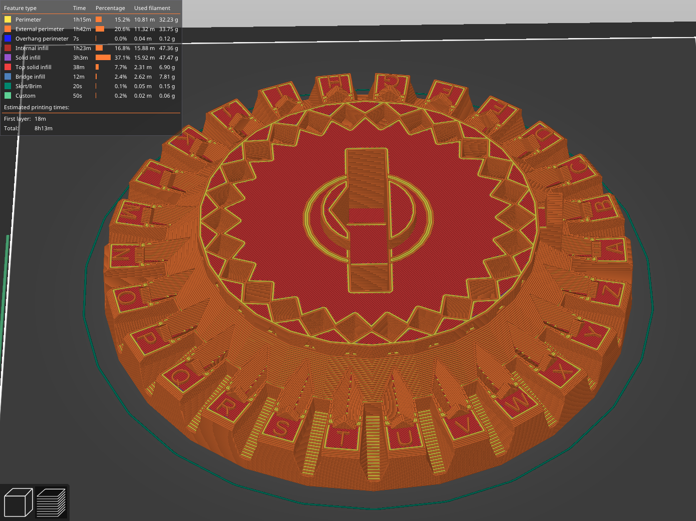
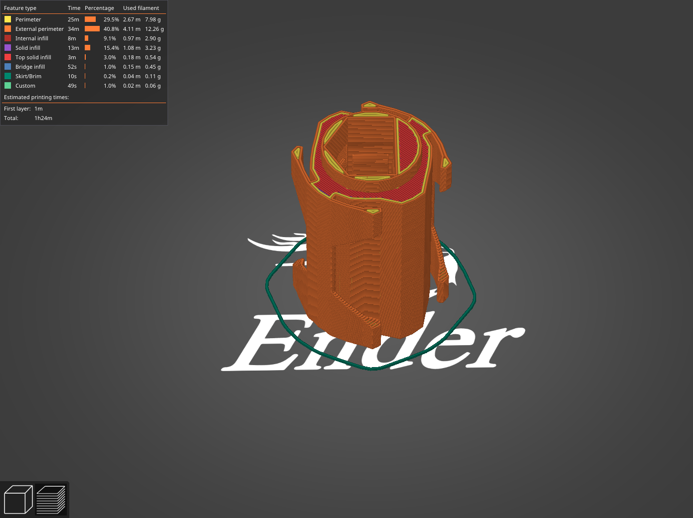
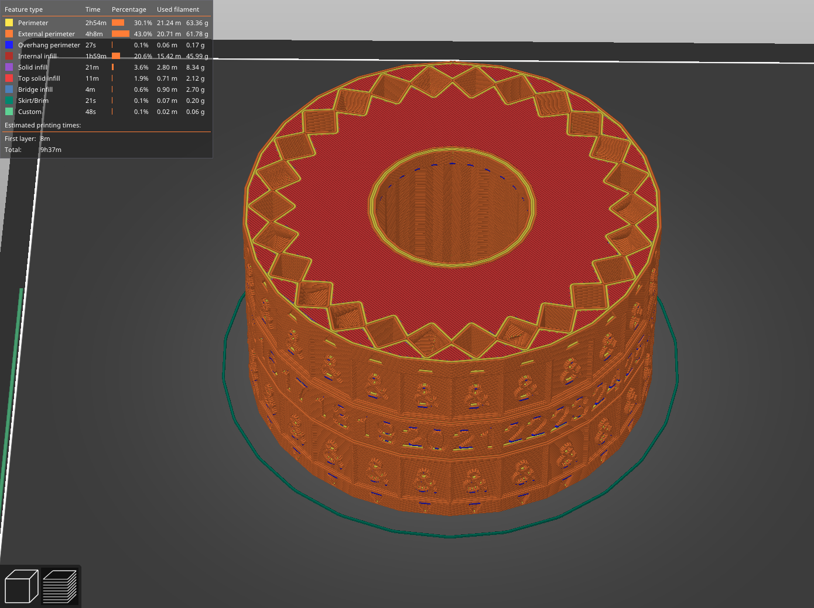
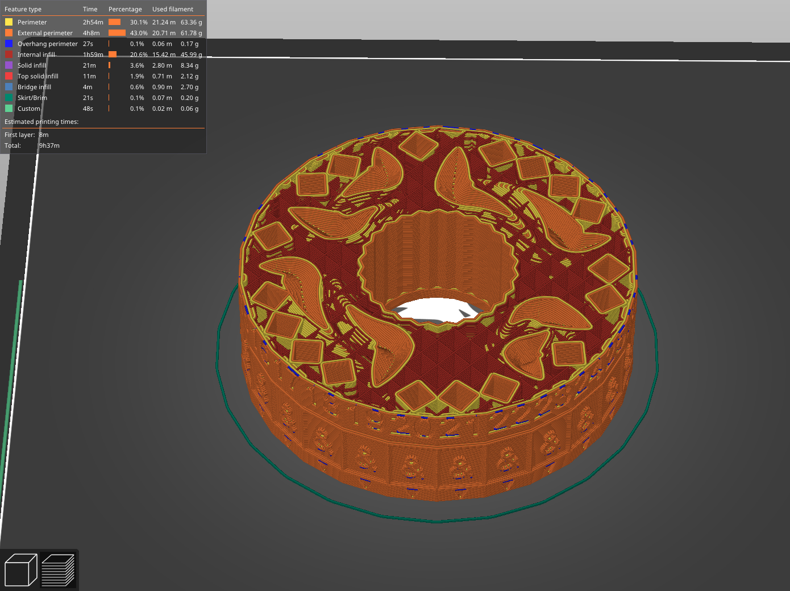
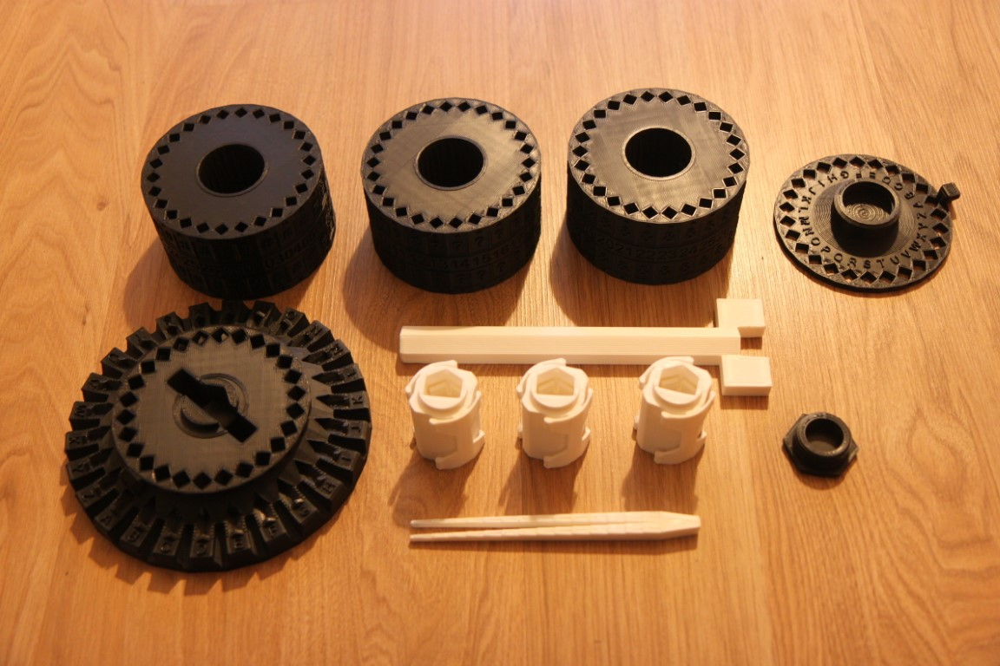
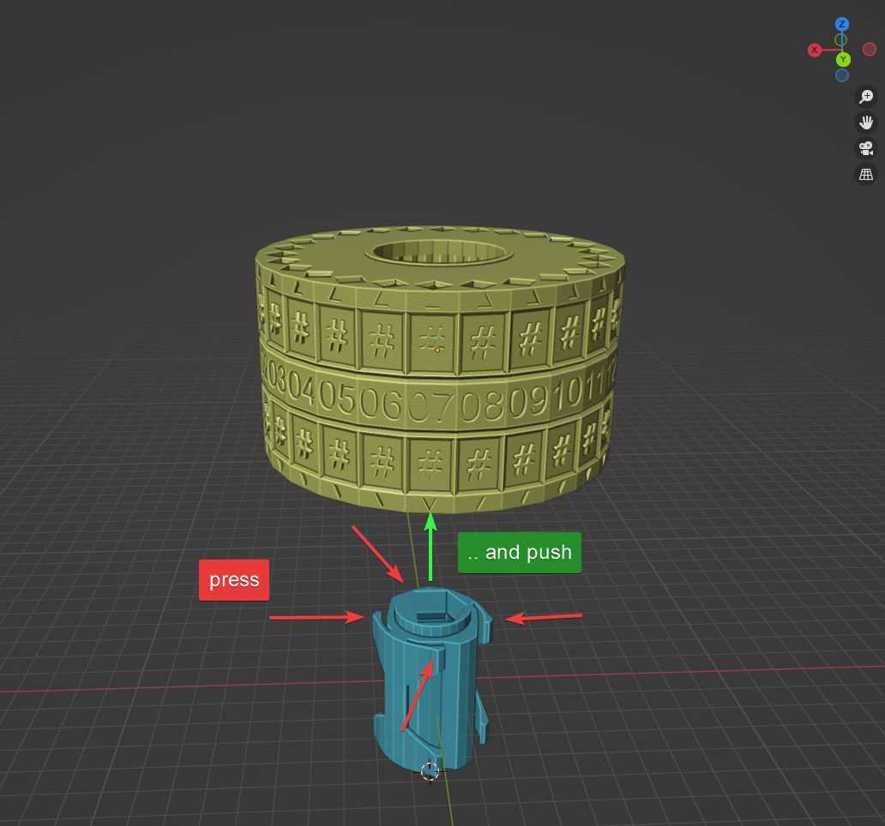
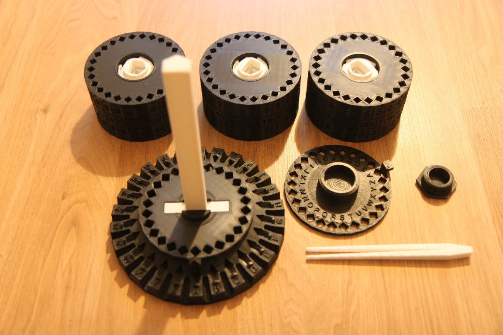
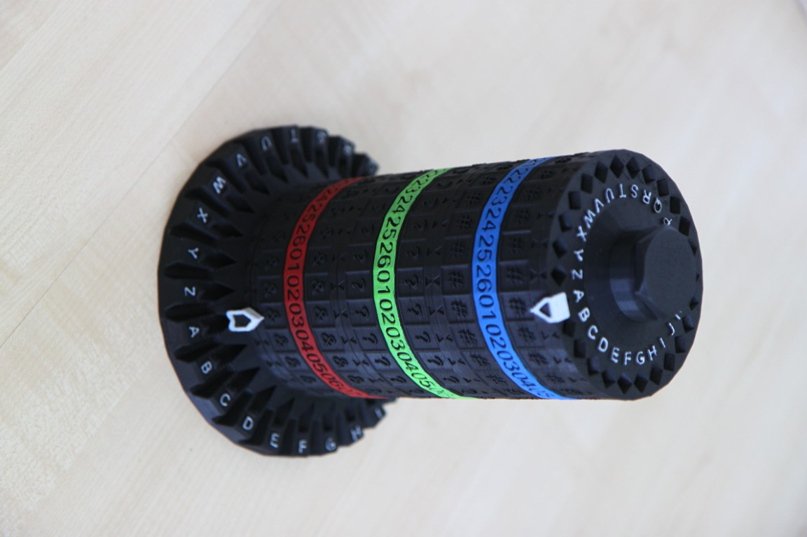

# Tower cipher printing

## Prerequisites
You will need:
- 1 kg of filament (a bit less, but it depends on your slicer settings)
- 5mm metal or glass ball

## Slicing
I recommend following settings for Prusa slicer but of course you know your printer and what works for it the best.
Nozzle diameter 0.6mm, layer height 0.35, no supports are needed.

### Axle
This part should be strong.
- 3 perimeters
- 15% gyroid infill

### Base, Top and Bolt
Nothing special, I've used:
- 2 perimeters
- 10% infill

### Break
**Print it 3x** and with following parameters:
- 2 perimeters
- 15% infill

### Rotors
The tricky part. Can be printed on Enter 3 with default speeds under 10 hours with following settings:
- 2 perimeters
- **10% rectilinear infill**
- add range modifier between heights 1mm - 57mm and set *Bottom solid layers* and *Top solid layers* to 0
  - this setting significantly reduce printing time while that infill supports pathways nicely
- Solid infill threshold area: 0

There is no need for solid infill inside the rotor.

### Tweezers
Tweezers can be a bit problematic if you have warping issues.
- 4 perimeters
- 15% infill (almost doesn't matter)
- I've turned off "Fill gaps" - that helped with warping because extruder is not returning back to fill in those tiny holes
- Classic perimeter generator instead of Arachne

## Printing
When your print is done you should have these parts.

## Assembly
Insert Axle into Base part (should be tight fit without any gabs, you can use a glue or any screws that fits the holes on the bottom if needed).

Insert Breaks into Rotors (see the picture).

Assembled parts:

## Coloring
Optional, I've used Citadel acrylic paints for miniatures with black undercoat.
