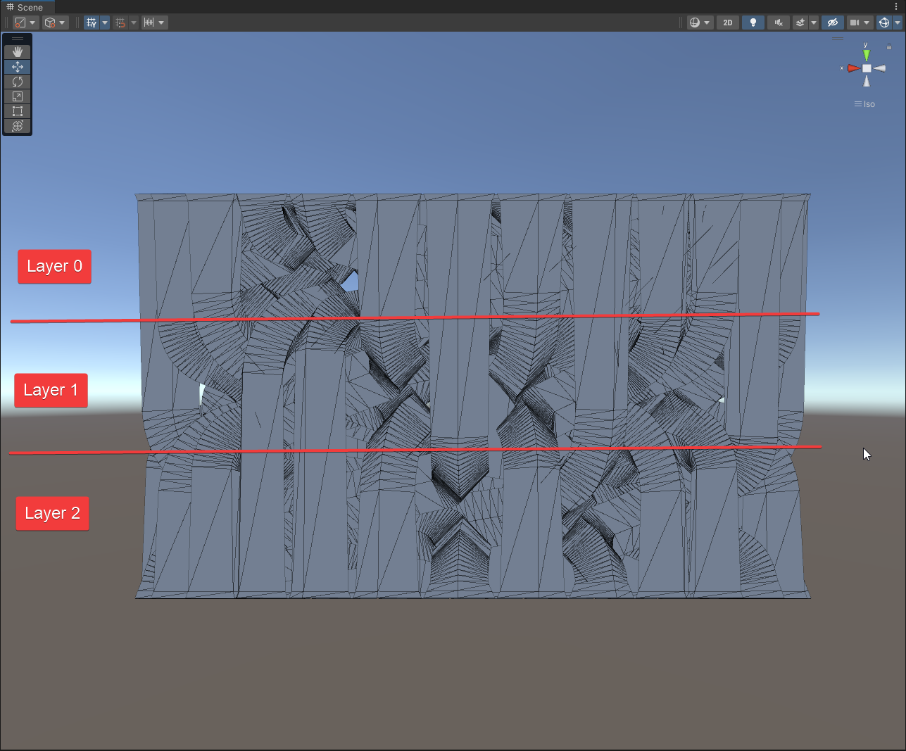
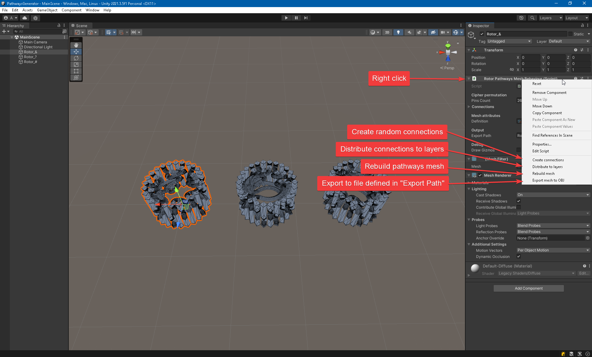
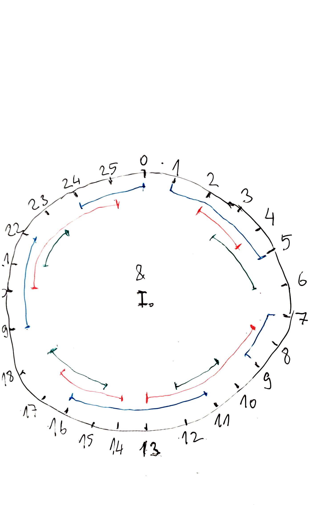
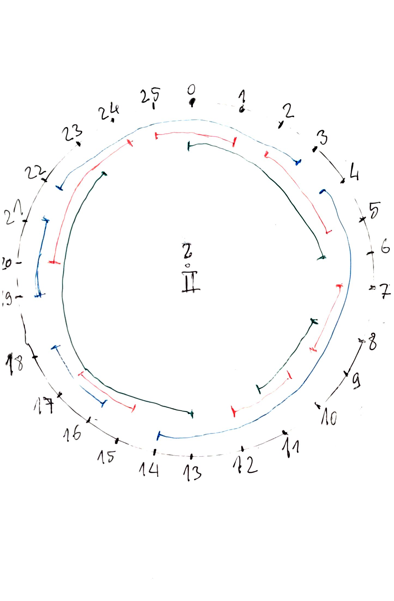
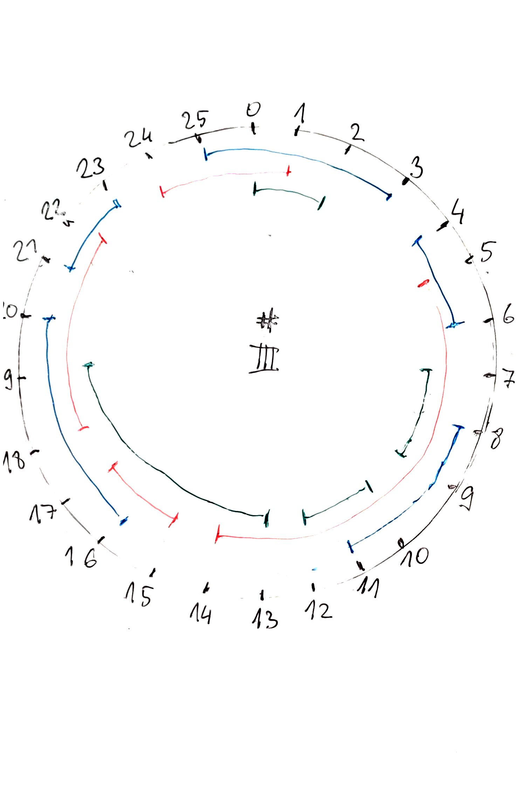

# Pathway generator
Pathway generator is a simple one purpose Unity project that I've used to generate internal pathways of the Tower cipher.
It's main purpose is to create mesh that represents internal structure - pathways - of Tower cipher rotors by following principle:
- there are "pins" around the rotor (now 26, but can be changed in definition)
- to avoid flipping the rotors in decryption process, connections between pins are organised as symmetric exchanges: if a pin A is connected with a pin B then the B is connected with the A
- exchanges are organized to layers
- each layer represents the one height where exchanges are created, each exchange consists of 2 connections: one runs on outer radius and one on the inner
- pathways are collision free
- pathways are 3D printable friendly (no bridges, no overhangs or other potentially problematic structures)

Following conditions must be met in order to create good mesh:
- if there is a connection from pin A to pin B in layer N, there must be also connection from pin B to pin A in the same layer defined in "Connections" parameter
- minimal distance between connected pin A and B is 2 (shorter distances needs special handling and that's not implemented)
- layers the connections are in must correspond to Layers count in RotorDefinition

## Program functions
Open the MainScene and check the following picture.

1. Create connections - fill connections with random values. *This is just experimental feature, it will generate random connections but they will probably not fit into given layers!*

2. Distribute to layers - first fit search also *highly experimental*.

3. Rebuild mesh - create mesh from given connections.

4. Export mesh to OBJ - export mesh to a file defined by **Export Path** parameter.

## Real usage
If you want to really create new pathways in current 3 layer setup then use following procedure:
- take pen and paper (I'm not joking)
- draw a large circle
- create 26 marks around it and write also they numeric values
- create connections by following rules:
  - distance between two connected pins must be at least 2 (generator doesn't work well on neighbouring numbers)
  - connections must not overlap in the same layer
  - connect all pins
- fill connections manually (forward and backward - from A to B and B to A should in the same layer)
- run Rebuild mesh
- run Export mesh to OBJ if everything looks good
- import to Blender
- snap to position of previous pathways in the rotor you've chosen
- replace pathways mesh in boolean operation of the rotor
- export rotor to STL
- import to slicer
- **carefully check sliced rotor layer by layer if there are any glitches, pathways overlaps, holes and so on**
- print

Rotors I've created look like this:

### Note:
Steepness of a pathway decreases with the distance between connected pins. From my experience pathways that are close to 13 pins long may cause the ball stop inside the rotor. 

## Notes
Whole code is written for single purpose, it works as it is but **edge-cases are not covered**. Use it at your own risk.
